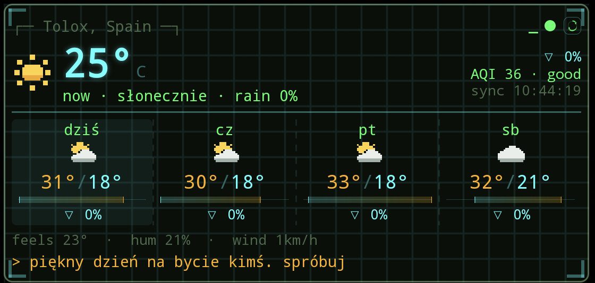

<div align="center">

# homebrew-weather

<sub>pixel-art weather, terminal-native</sub>

<br/>

[](https://github.com/pi0trdotsys/Homebrew-Weather/releases)
[](#stack)
[](https://open-meteo.com/)
[](#android-beta)

</div>

<br/>

<p align="center">
  
</p>

<p align="center">
  
</p>

<p align="center">
  
</p>

<br/>

```
NAME     homebrew-weather — pixel-art weather forecast for developers
DATA     open-meteo.com — no key, no tracking, no backend
PLATFORM web (PWA) + native Android widget
```

## Features

- Pixel-art icons, CRT phosphor glow, typewriter forecast output
- Native Android home-screen widget — sizes every element to whatever footprint the
  launcher actually grants it, from a 180×90dp squeeze up to a full-width tile, and
  drops rows in a fixed order rather than shrinking everything into illegibility
- 4-day grid with temperature range bars on a shared scale, live AQI, rain trend
- Refresh button, per-instance city picker, themes, own background worker
- Rain / high / low / swing / AQI notifications with attitude, thresholds set in `./settings`
- Zero backend — talks to [Open-Meteo](https://open-meteo.com/) directly, on-device

## Stack

`TanStack Start` `React 19` `Tailwind v4` `Capacitor` `Kotlin` — see [Android](#android-beta) for the native half.

## Run

```bash
bun install
bun run dev
```

## Android (beta)

```bash
bun run build:capacitor
bunx cap sync android
cd android && ./gradlew assembleDebug
```

Add the widget from your launcher's picker — pick a city, it runs on its own from there.
Resize it however you like; it re-solves its own layout for the new footprint.
Latest build: [Releases](https://github.com/pi0trdotsys/Homebrew-Weather/releases).

Widget internals — the size solver, the RemoteViews constraints it works around, and
the real-device bugs that shaped both — are written up in
[`docs/widget-spec.md`](docs/widget-spec.md).
