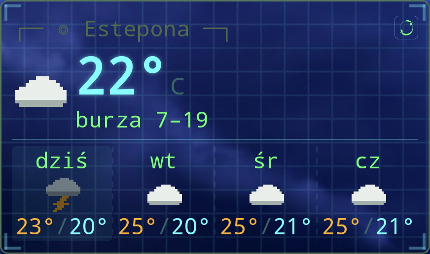

<div align="center">

<br/>

# homebrew&#8209;weather

**The forecast, minus the noise.**

<sub>A pixel-art weather widget for Android that speaks up only when the sky has something to say.</sub>

<br/><br/>



<br/><br/>

[](https://github.com/pi0trdotsys/Homebrew-Weather/releases/latest)
&nbsp;
[](https://github.com/pi0trdotsys/Homebrew-Weather/releases)

</div>

<br/>

```
01  ─  rain, pinned to its day      today up top, other days under their column: ▽ 7–19
02  ─  quiet on quiet days          a dry day is a number and four days, nothing more
03  ─  tap a day, see its hours     the widget opens the app on that day
04  ─  mornings and evenings        a brief at breakfast, tomorrow at dinner
05  ─  rain heads-up, both ends     before it starts, and before a long spell stops
06  ─  fits whatever you give it    any size; a calmer day gets bigger type, not gaps
07  ─  your language, your tone     polski · english  ·  clean · sigma · rude
```

<br/>

<div align="center">

### Get it

</div>

1. Grab the **APK** from the [latest release](https://github.com/pi0trdotsys/Homebrew-Weather/releases/latest) and open it on your phone.
2. Long-press your home screen → **Widgets** → **Homebrew Weather**.
3. Pick a city and a density (*minimal*, *standard* or *full*). That's it. It refreshes on its own.

Tap the widget to open the full forecast for that city, or tap a day to see its hours.
Language, brief and evening times, alert thresholds and tone are under **./settings**,
along with a button that sends one of each notification so you can see them right away.

> **Updating from beta.7 or earlier?** Uninstall the old version once, then install. From
> beta.8 onwards, new versions install right over the top and your widgets stay put.

<br/>

<div align="center">

<sub>

**private by default**: no account, no ads, no tracking, no server of ours  
weather straight from [Open-Meteo](https://open-meteo.com/) · location is optional, a city name works too  
polski or english, your pick · still in beta, so rough edges are expected

<br/>

[for developers →](docs/DEVELOPMENT.md)

</sub>

</div>
